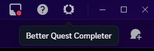

# Better Quest Completer

Lightweight and better Discord quest completer plugin for **Vencord / Equicord**.  
Automatically completes supported Discord quests by simulating required activity types.

---

## ✨ Features

- Automatically completes **uncompleted & active quests**
- Supports multiple quest types:
  - 📺 WATCH_VIDEO 
  - 🎮 PLAY_ON_DESKTOP
  - 📡 STREAM_ON_DESKTOP
  - 🕹️ PLAY_ACTIVITY
  - **(Works for all quest types)**
- It shows useful notifications for you.
- Desktop client & browser detection
- Clean header bar button integration
- Lightweight & minimal

---

## 🧩 Supported Clients

- **Vencord**
- **Equicord**
- **other vencord forks like equicord**

> ⚠️ External plugins **must be installed from source**.

---

## 📦 Installation (Overview)

> Detailed installation steps are available in the **official documentation**.  
> Please refer to the links below.

General steps:
1. Install **Vencord** or **Equicord** from source **(It is very important that you do this and its so easy to do)**
2. Clone the repository inside your Vencord(or Equicord)/src/userplugins folder (create the userplugins folder if it doesn't exist)
3. If you want you can delete the readme and button.png files, they are not needed.
4. Copy the plugin files into the `userplugins` folder. It's look like `Vencord(or Equicord)/src/userplugins/better-quest-completer/index.tsx, style.css` (index.tsx and style.css must be in same folder named better-quest-completer)
5. Then again `pnpm build`, `pnpm inject`, as written in the documentation.
6. Reload Discord and turn on the Plugin from in the Plugins section

📚 **Official documentation for installing/building from source:**
- Vencord: *(https://docs.vencord.dev/installing)*
- Equicord: *(https://docs.equicord.org/building-from-source)*

---

## 🚀 Usage

1. Open Discord
2. Click the **Better Quest Completer** button in the header bar (right top)
3. The plugin will:
   - Detect an active quest
   - Automatically complete quest
   - Show notifications during progress

If no active quests are found, you will be notified.

---

## ⚙️ Settings

- **Enable Notifications**  
  Toggle quest progress and completion notifications.

---

## ❗ Known Limitations

- Some quests **require Discord Desktop Client**
- Streaming quests require **at least one other user in the voice channel**
- Browser support is limited to video quests only

---

## 📄 License

This project is protected under an MIT license.

---

## ❤️ Credits

- Plugin author: **[k4g9](https://discord.com/users/848987722751410206)**
- Built for the Vencord / Equicord plugin ecosystem
